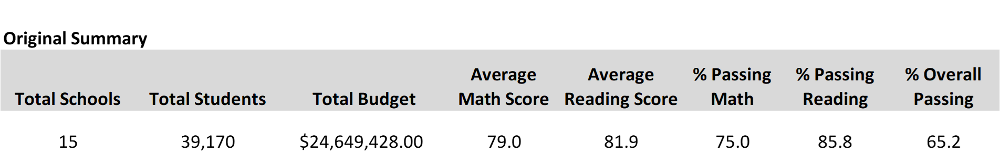
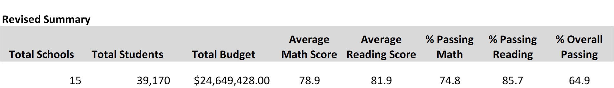
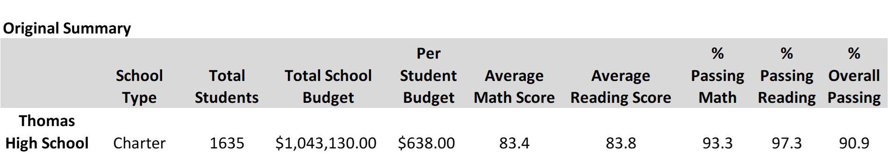
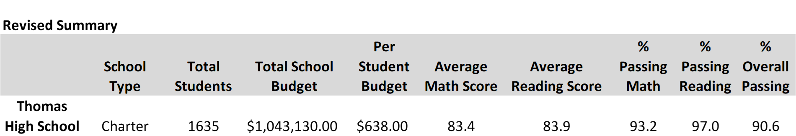

# School_District_Analysis
UNC - Module 4

# Project Overview
We were asked to revise the previous summary of the school district test data due to potential irregularities in the test scores for the ninth-grade at Thomas High School.

### •	District Summary
All calculations based on the math and reading scores decreased slightly on the revised summary.  

  

### •	School Summary
The only change in the school summary was to the Thomas High School listing.  The ninth-grade students were removed from the count used to calculate the scores to prevent a skewed view of the averages since their test scores were removed from the records.  This resulted in a slight decrease in the results.

### •	School Rankings
Thomas High School remained in second place for Percentage of Overall Passing after the ninth-grade scores were removed.  The drop from 90.94 to 90.63 still kept them ahead of Griffin High School at 90.59.
